<div align="center">
  

  <a href="https://www.creativefield.app/examples/creativefield-promo-v3.mp4"></a>

  [▶ Watch the CreativeField video](https://www.creativefield.app/examples/creativefield-promo-v3.mp4)

  # CreativeField

  **A free, open-source creative studio on ComfyUI: video, pictures and 3D from a few words, plus FotoField, an AI photo editor. Run it on your own computer, or online on your own Comfy credits.**
</div>

**[Try it online at creativefield.app](https://www.creativefield.app/)** — every browser gets its own private try-out workspace. Your library stays in your browser and FotoField documents never leave it. A file reaches the server only while it is needed: the server drops it a few minutes after your browser holds a checked copy, and it goes back up only when a render needs it. Run records stay on the server until a day without a visit. Sign in with your own Comfy API key and renders run on Comfy Router on your Comfy credits, the free plan included: FLUX 2 Pro for pictures, angles and relight, Seedance 2.5 and MiniMax H3 for video and keyframes, Kling V3 Omni for new look, swaps and copied moves, Kling Lip Sync, FLUX video upscale and Bria for upscaling and cut-outs. Online, the menus only show what can really run there. The key is kept in your browser; the server only holds it in memory while it talks to Comfy for you.

### Three steps

| Pick a tool | Add words or a picture | Press Generate |
|---|---|---|
| 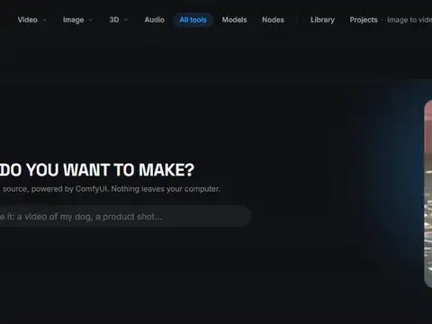 | 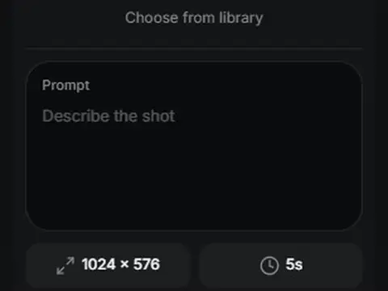 | 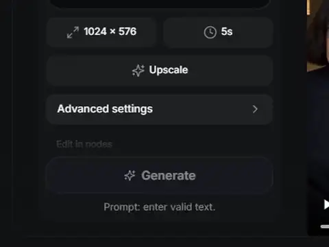 |

## What is new

- **Keyframes on a timeline.** Put pictures at exact moments, drag them to any second, describe each transition on its own, and get one animation that hits every frame on time. Locally with HyperFlow H3 Flash, online with Seedance 2.5 or MiniMax H3.
- **Make it real.** Block out a scene with grey 3D shapes and a camera move, and turn that animation into a real-looking video that keeps the camera path, the timing and where everything stands.
- **Character swap, sharper.** Single-character swaps run on HyperFlow H3 Flash with a qualified handoff from the scene still to the video; multiple characters can be swapped in one clip with MiniMax H3.
- **Sound that sounds natural.** Every H3 video gets an automatic audio finish: rumble and hiss filtered out, harsh S sounds tamed, gentle compression and a broadcast loudness level, while the original track stays in the file.
- **Menus by function.** Video, Image and 3D open as rows of what you want to do (make a video, people and motion, change a video, finish), each with small tiles that play a short preview on hover and a mark for the model that runs it. They are workflows, not a list of models.
- **HyperFlow H3 Flash** is the local default for video: from words, from a picture, between a first and last frame, Effect clips and single-character swaps, with an optional upscale finish.
- **Edit Area tracks by itself.** Mark a thing once and the mask follows it through the clip; one render applies your prompt only there.
- **Reframe a video.** Transform Video can give a clip a new format and extend the scene beyond its edges, locally with HyperFlow.
- **Write the prompt from your images.** Drop references and let the app describe them; you can undo the suggestion.
- **Know how long it takes.** Generate shows the usual time for that tool, the running clock shows the stage (getting ready, rendering, upscaling), and every result keeps its render time.
- **Phone layout.** A bottom tab bar, menus and dialogs as sheets you pull down to close, one column, the main action pinned in reach.
- **Faster start.** Big screens load when you first open them, and hovering a link already starts loading it; media load only when they come into view.
- **More online.** Picture tools (angles, relight, upscale, cut out), Make it talk and keyframes with Seedance 2.5 or MiniMax H3 now run on Comfy Router.

## What each function does

| Create a video | Effect clips | Copy moves | New look |
|---|---|---|---|
|  |  |  |  |
| **Swap a thing** | **Storyboard** | **Block a shot** | **FotoField** |
|  |  | 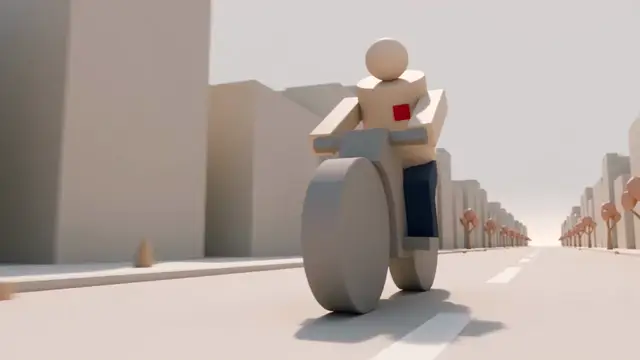 | 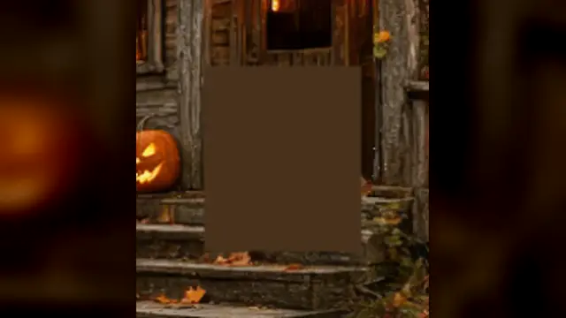 |
| **Change a picture** | **Camera angles** | **Relight** | **Sharper and bigger** |
|  |  |  |  |

These loops are the previews the menus play; they show what kind of change a function makes, not a measured result of one workflow.

Made for the [#OpenSourceHiggsfield](https://comfy.org/open-source-higgsfield/) challenge.

## Why CreativeField

CreativeField is a welcoming place to turn a small idea into something you can see, hear and share. Start with a few words or a picture, explore a result, then take it further: make a video, adjust an image in FotoField, or try another angle. Your work stays together in the project library, ready when inspiration strikes again.

**Made for a comfortable creative flow.** Choose what you want to do from visual menus, add your ingredients and generate. Hover over a tool to see a preview, compare results, and revisit a take with its settings when you want another version. ComfyUI does the heavy lifting in the background; you can open the nodes when you want more control.

**On an RTX 4090, locally.** CreativeField has been developed and tested on a Windows computer with an RTX 4090 and 64 GB of RAM. In one separate experimental HyperFlow H3 Flash and Deno run, a 3.04-second image-to-video clip took about **3 minutes** to generate and refine to 1088 × 1440. This is one measured result from an experimental setup, not a speed promise for the current app: clip length, resolution, model loading, settings and other work on the computer all affect the wait. The app shows the run's progress and records its time so you can see what your own setup does.

Having a pro-grade palette at your fingertips, and every feature ComfyUI brings with it, does not mean you need a toolbox with all the equipment in it. Most of the time the work comes down to a few core moves: you start from an input and you want a video, a picture, or an edit of a picture. CreativeField is built around exactly those moves.

Along the way we built our own free, open-source, AI-powered alternative to Photoshop. It runs locally, and it works.

**Everything connects.** CreativeField is meant to cover a whole workflow, not a list of separate tools. Make a picture, then edit it. Use it as the reference for a video, or turn it into a 3D model. Use that 3D model as the reference for the next picture or video edit, and keep going. We will keep extending it towards the top ten film-creation tools and the most important photo-editing goals, all working together.

**Nodes you can read.** We are reworking how ComfyUI nodes look, so a graph is clearer and easier to use. A first design preview is in the app; the goal is a short description on every node that tells you what it does.

**Your workflows become apps.** Browse the official Comfy templates, download a workflow or build your own, and CreativeField checks it against your ComfyUI (or Comfy Cloud) and turns it into an app in the matching menu row of Video, Image or 3D. Proven end to end with two official templates: Z-Image Turbo (placed under Create a picture, rendered a picture) and Hunyuan3D 2.1 (placed under Make a 3D model, made a 3D model from a picture).

We are open to ideas. Open an issue and tell us what you would like to see next.

## Models

CreativeField picks one model per job instead of offering a long list. On your computer these carry the app:

| Model | Job in CreativeField |
| --- | --- |
| **HyperFlow H3 Flash** | The default for local video: from words, from a picture, between a first and last frame, Effect clips, single-character swap (OpenJutsu) and reframing, with an optional upscale finish |
| **MiniMax H3** | Multi-character swap, object swap and Grey-block to video; also online through Comfy Router |
| **FLUX 3 Klein** | Creates images; also camera angles and relight |
| **Fibo 2.0** | Edits images: multi-picture edits, masked edits, Ad Studio and Remix variations |
| **Qwen Image 2.1** | The first choice for AI edits in FotoField; also creates images, turns objects to new angles, and is the fallback for FLUX 3 Klein |

Online, on Comfy Router: FLUX 2 Pro (pictures, angles, relight), Seedance 2.5 and MiniMax H3 (video, keyframes, effects), Kling V3 Omni (new look, swaps, copied moves), Kling Lip Sync, FLUX video upscale, Bria upscale and background removal.

If the first choice for a job is not installed on your computer, the app takes the next one that is ready and says so. Workflow folders named `flux2-klein-*` keep their old names but run FLUX 3 Klein weights.

A few jobs stay with specialised models: SAM 3.1 for masks, SeedVR2 and Z-Image Turbo for upscaling, Hunyuan3D 2.1 and TRELLIS.2 for 3D. New look and Copy moves still run on Wan 2.1 VACE, SCAIL-2 and Wan Animate 2, and Make it talk on Wan 2.1 InfiniteTalk.


**FotoField**, our image editor, has layers, masks, selections, smart objects, blend modes, crop, transform and brushes, and its AI tools (modify, magic eraser, subject select) run through ComfyUI on your machine. No subscription and no account; nothing leaves your computer unless you choose a cloud route. The rest of CreativeField puts the same idea around video, image and 3D: each tool is a real ComfyUI workflow behind a plain panel, and you can open the graph when you want it.

It is an early preview, not a Photoshop clone. FotoField covers the everyday layered-editing and AI-editing path; it does not yet match Photoshop's depth (see [Current limits](#current-limits)).

## Status

| | |
| --- | --- |
| **Apps** | More than 40 workflow folders in `native-workflows/` plus the official-template pipelines in `pipelines/`, each with a manifest that binds the simple panel to the graph. |
| **Built with ComfyUI** | Local generation runs in your ComfyUI. Online, tools with a Comfy Router contract run on your Comfy credits; not every contract has been proven with a render on every account. |
| **Works on** | Desktop browsers from 1280 px, and phones (one-column layout with a bottom tab bar). |
| **Proven on this machine** | Windows 10, RTX 4090, 64 GB RAM: MiniMax H3 video from words, pictures and grey blocks, FLUX 3 Klein images, Fibo 2.0 and Qwen Image 2.1 edits, masked video edits, character replace (experimental), Image to 3D. |
| **Not proven** | macOS and Linux, a clean install on a fresh machine, the cloud routes, output quality on other hardware. |

## Apps

| App | What it does | Models | Status |
| --- | --- | --- | --- |
| **FotoField** | Layered photo editor with AI modify, magic eraser, subject select and masks | Qwen Image 2.1, Fibo 2.0, FLUX 3 Klein, SAM 3.1 | Working; the AI part needs an image-edit workflow installed |
| **Create Video** | Words, a picture, or a first and last frame to video with sound; Effect clips from one photo; Sharpen 2× keeps the same take at twice the size | MiniMax H3 | Working; camera moves are prompt guidance (see below) |
| **Change Video** | Replace character, swap a thing, new look, copy moves, sharpen and upscale | MiniMax H3, SAM 3.1, SeedVR2, Wan 2.1 VACE, SCAIL-2, Wan Animate 2 | Working; replace character is experimental |
| **Image** | Make a picture, edit it, turn an object to new angles, relight | FLUX 3 Klein, Fibo 2.0, Qwen Image 2.1 | Working |
| **3D** | Image to 3D, Text to 3D, viewer, textures, mesh tools | Hunyuan3D 2.1, TRELLIS.2 | Working |
| **Block a shot** | Pick a set and a camera move: a grey layout is drawn, then Grey-block to video turns it into a real shot that keeps the camera path and where everything stands | MiniMax H3; Wan 2.1 VACE depth restyle when H3 is not ready | Working on a GPU; three sets, eight moves |
| **Edit Area** | Mark a thing once; the mask tracks it through the clip and one render changes only that part | SAM 3.1, Wan 2.1 VACE | Working on a GPU |
| **Reframe** | A new format for a clip, the scene extended beyond its edges | HyperFlow H3 Flash | Working on a GPU |
| **Keyframes** | Pick moments, describe each transition, get one animation | HyperFlow H3 Flash locally; Seedance 2.5 or MiniMax H3 online | Working |
| **Short film** | Write the shots, make each one, get one video | MiniMax H3 plus FFmpeg assembly | Assembly works; identity can drift between shots |
| **Import a workflow** | Turn a saved ComfyUI workflow file into a simple panel: inputs, controls and result are found for you | the nodes and models installed on your ComfyUI | Working; 7 of 11 saved workflows on our test machine convert, including current Flux 3 Klein, Fibo 2, Z-Image, SeedVR2 and MiniMax H3 templates. API exports and graphs with an unconnected required input are refused |

## Screenshots

| All tools | Create Video |
| --- | --- |
|  |  |
| **FotoField editor** | **Keyframes workspace** |
|  |  |
| **3D workspace** | **Nodes editor** |
|  |  |
| **Trim video** | **Project library** |
|  |  |
| **Video menu by function** | **Image menu by function** |
| 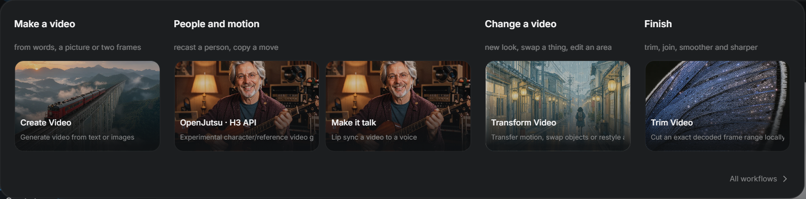 | 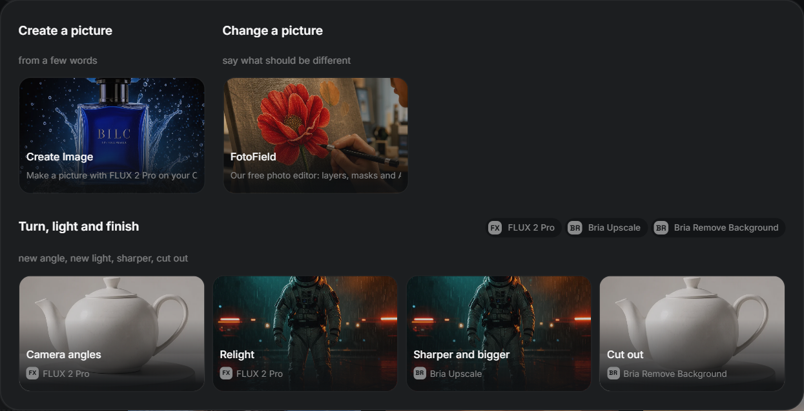 |
| **Online Create Video** | **Online keyframes** |
| 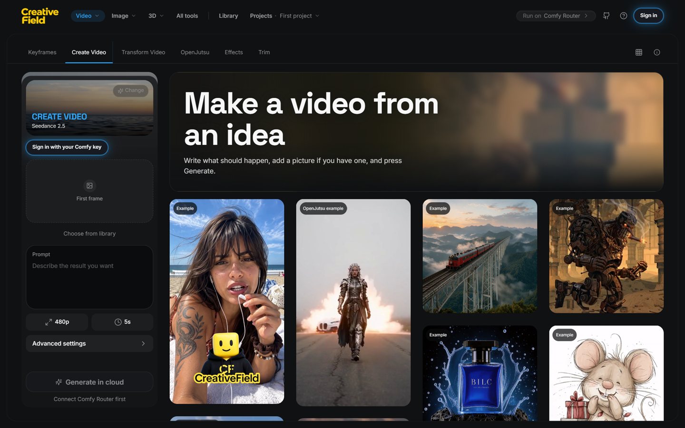 | 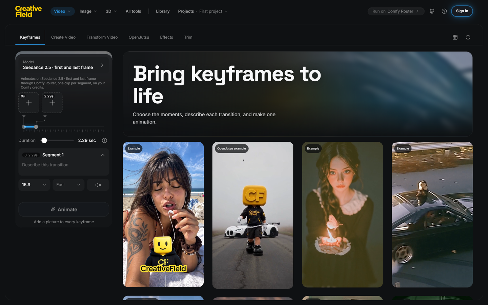 |
| **How it works, with live loops** | **Choose the model** |
| 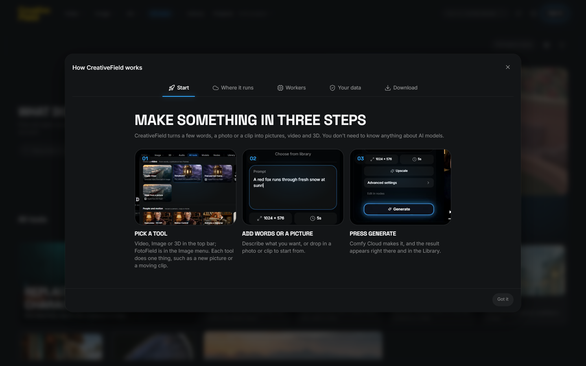 | 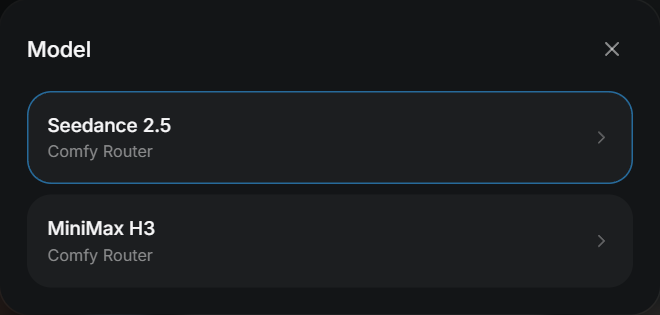 |
| **How it was made** | **Create Image** |
|  |  |

**On a phone**

| Start | Create Video | Image menu |
|---|---|---|
| 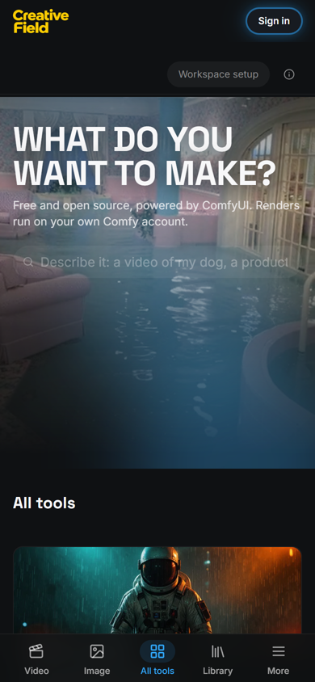 | 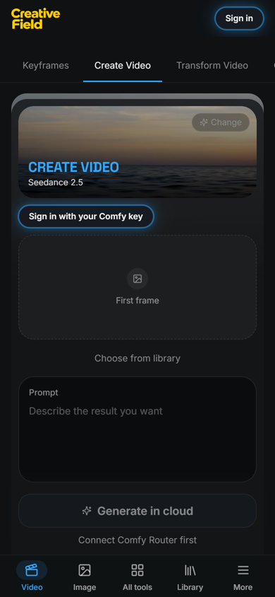 | 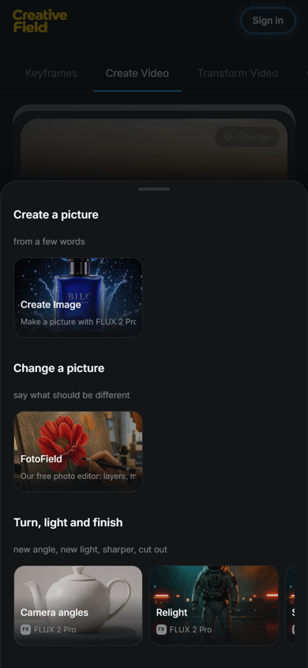 |

These screenshots show the application in a demo project. They show the interface, not a claim about output quality; the Nodes view shows a sample image graph.

### Camera moves are measured, not assumed

On MiniMax H3 a camera move is a direction in the prompt, not a fixed path: the model follows it, but not by an exact amount. When a shot needs one exact path, use **Block a shot**: H3 keeps the camera path of the grey layout frame for frame. The `wan22-fun-camera` workflow, which takes a fixed path, also stays in `native-workflows/`. `scripts/camera-check.mjs` measures how far any clip really moved, and `scripts/motion-check.mjs` tells a living clip from a still one. `scripts/seam-check.mjs` says whether a clip loops cleanly or jumps at the loop point, judges a cut inside a clip, and can trim a clip to its best closing window; it is a port of the Seam Doctor in [OpenField](https://github.com/wexloops/openfield) and the seam check in [Body Double](https://github.com/lucataco/open-source-higgsfield).

## Run it

**Requirements:** Node.js 22 or newer, a desktop browser at 1280 × 720 or larger (phones work for the online version), and ComfyUI on the same machine for generation. Models and custom nodes are installed separately and have their own hardware needs and terms.

1. Install [ComfyUI](https://github.com/comfyanonymous/ComfyUI). The Windows portable build works. To start it from here, set `COMFY_HOME` to its folder and run `scripts/start-comfy.bat`.
2. From this folder:

```bash
npm install
npm start
```

3. Open [the local studio](http://127.0.0.1:8787). The first start prepares the app and its database.
4. Open **Models**, pick a workflow and check what it needs. An online worker alone does not mean its models and nodes are installed.
5. Choose a tool in **All tools**, add your inputs and press **Generate**.

FotoField works without any model for everything except the AI buttons. Copy `.env.example` to `.env` to change ports, storage or the cloud key.

## Add an app

Every app is a folder in `native-workflows/` with a ComfyUI graph (`template.api.json`) and a `manifest.json` that says which node fields the panel exposes. We do not rewrite graphs: an app is an official, hub or your own ComfyUI workflow with a simplified front. You can also import a saved workflow in the app; it keeps only the controls it needs inline and leaves the rest under **Advanced**.

## Connections and data

Local generation uses your configured ComfyUI worker. Cloud is optional: select a supported connection and check the model, account access and cost before submitting anything. Cloud runs can send selected inputs to the provider and can consume credits. A ChatGPT subscription should not be assumed to support every image-editing operation.

Keep generated runtime configuration, credentials, account profiles, project data and backups private. Never include them in a source contribution.

## Current limits

- **FotoField is not Photoshop.** It has layers, masks, smart objects, selections, blend modes, crop and transform, but no CMYK, no raw development, no plug-in ecosystem and fewer filters and adjustment layers.
- **Replace character is experimental.** Reference fidelity, multi-person replacement, the still-to-video handoff and overlay cleanup need further visual qualification.
- **Online routes need qualification per account.** The menus only show tools with a Comfy Router contract, but a contract is not proof that every model succeeds for your account and credits. Storyboard and the local-only workflows (HyperFlow, Wan, SCAIL, Qwen, Fibo, FLUX 3 Klein, 3D generation) are not online yet.
- **3D:** the native Image to 3D panel is integrated; other 3D tools remain editor/template entry points. This UI work did not requalify model outputs.
- **Not yet rehearsed:** a clean install on a fresh machine, and macOS or Linux.

## Development

```bash
npm run build
npm run server:check
```

Contributions should include screenshots made with nonprivate demo content for interface changes. Keep existing workflows and permission boundaries intact.

## Credits and licenses

Application code: [GNU GPL version 3](LICENSE) (`GPL-3.0-only`), copyright **bashpacks**. External components and model weights retain their own terms; see the [workflow license inventory](docs/LICENSE-INVENTORY.md). The application license does not grant rights to third-party models, nodes or media.

The pictures and clips on the tool cards and heroes are AI-generated with Midjourney by the author; the FotoField card uses a Pexels photo (see `fixtures/real/SOURCES.md`).

Made by **bashpacks**.
